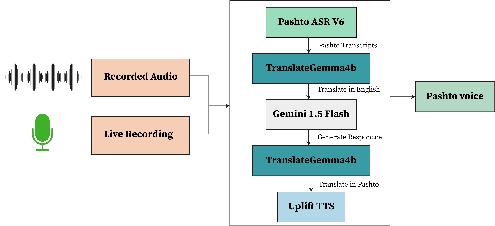
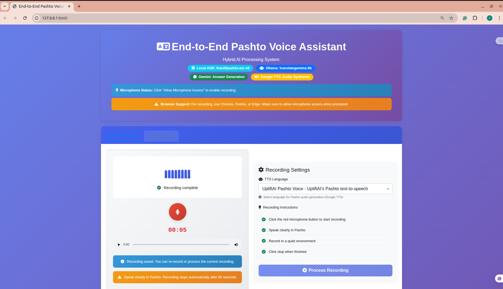

# 🔄 **End-to-End Pashto Voice Assistant**

The Pashto Voice Assistant is a modular, high-performance conversational AI system that transforms user speech into intelligent, natural Pashto responses. Each stage of the pipeline is carefully optimized for accuracy, efficiency, and scalability.

## 🎙️ 1. **Audio Input Processing**

The system accepts user speech through two flexible input methods:

Live microphone recording via the browser interface

Audio file upload in standard formats like MP3 or WAV

All audio is automatically preprocessed and normalized for optimal ASR performance:

Converted to WAV format

Resampled to 16 kHz

Converted to mono channel

This ensures consistent, high-quality transcription for the next stage.

## 🧠 2. **Pashto Speech Recognition (ASR)**

The preprocessed audio is transcribed using the Hugging Face hosted ihanif/pashto-asr-v6 model, a deep learning–based Pashto speech recognition system.

Key Features:

Accurate Pashto speech-to-text transcription

Optimized for real-world conversational audio

GPU-accelerated using NVIDIA RTX A6000

Robust performance across diverse Pashto accents and speaking styles

The output is clean, machine-readable Pashto text, ready for reasoning and translation.

## 🌐 3. **Translation & Intelligent Response Generation**

To leverage advanced LLM reasoning, the system uses a translation–reasoning loop:

### Step 1: **Pashto → English Translation**

Pashto text is translated into English using Ollama translategemma:4b

Enables high-quality LLM reasoning

### Step 2: **Intelligent Response Generation**

Translated text is processed by Google Gemini 2.5 Flash

Generates contextually accurate, intelligent responses

### Step 3: **English → Pashto Translation**

The response is translated back into Pashto using Ollama translategemma:4b, ensuring the final output is fully native

This approach bridges the gap between low-resource languages and state-of-the-art LLM capabilities.

## 🔊 4. **Pashto Text-to-Speech Synthesis (TTS)**

The final Pashto text is converted into natural speech using the UpliftAI TTS API.

Key Features:

High-quality Pashto voice synthesis

Uses dedicated Pashto voice profile: v_8eelc901

Generates audio in MP3 format

Optimized for clarity, natural pronunciation, and low latency

## Project Architecture Diagram

This stage ensures fully conversational, interactive Pashto communication.  
The project architecture diagram is shown below:

